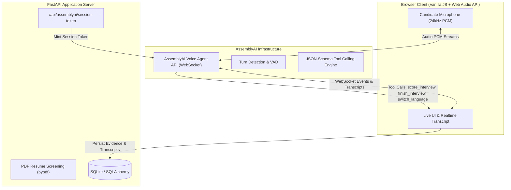

# 🎙️ Interviewa AI — Structured Voice Interviews with AssemblyAI

> **Built for the AssemblyAI Voice Agent Hackathon (lablab.ai)**  
> *Real-time oral voice interviews, bilingual candidate interaction, JSON-Schema tool calling, and policy-safe human review.*

---

## 💡 Overview

**Interviewa AI** transforms traditional recruitment by providing structured, real-time voice interviews powered by **AssemblyAI’s Voice Agent API**. 

It bridges candidate evaluation with human-centered hiring ethics:
- **AI as Evidence Collector**: AI conducts conversational interviews, detects candidate language, rephrases complex questions, and records structured evidence.
- **Human as Decision Maker**: Employment decisions are strictly reserved for human recruiters and hiring managers based on advisory AI scorecards.

---

## 🏗️ Architecture & AssemblyAI Integration



---

## 🔥 Key Features

- **AssemblyAI Voice Agent Integration**: Full bi-directional WebSocket streaming (`wss://agents.assemblyai.com/v1/ws`) with low-latency PCM audio.
- **6 JSON-Schema Tool Calls**:
  1. `score_interview`: Saves job-related evidence scores and rubrics live.
  2. `finish_interview`: Gracefully terminates completed interviews.
  3. `pause_interview`: Handles candidate-requested breaks.
  4. `rephrase_question`: Clarifies questions dynamically upon candidate request.
  5. `switch_language`: Real-time language switching (English ↔ Kiswahili).
  6. `request_human_interviewer`: Logs accommodation and human reviewer requests.
- **Bilingual Support (English + Kiswahili)**: Automatic language detection and natural voice responses.
- **Interviewer Training Simulator**: Allows recruiters to practice interviewing 5 distinct AI candidate personas (`nervous_junior`, `experienced_leader`, `career_changer`, `overconfident`, `non_native_english`).
- **PDF Resume Screening**: Automatically extracts key competencies from candidate PDFs using `pypdf` before scheduling interviews.
- **Multi-Tenant RBAC & JWT Session Auth**: Role-based views for Company Admins, Recruiters, Hiring Managers, and Candidates.

---

## 🚀 Quick Start (Local Setup)

```bash
# 1. Clone & create virtual environment
python3 -m venv .venv
source .venv/bin/activate

# 2. Install dependencies
pip install -r requirements.txt

# 3. Configure environment
cp .env.example .env
# Set your ASSEMBLYAI_API_KEY in .env

# 4. Launch FastAPI server
uvicorn app.main:app --reload
```

Then open [`http://localhost:8000`](http://localhost:8000).

---

## 🔑 Demo Accounts

| Role | Email | Password |
| :--- | :--- | :--- |
| **Company Admin** | `admin@interviewa.ai` | `password123` |
| **Recruiter** | `recruiter@interviewa.ai` | `password123` |
| **Hiring Manager** | `hiring@interviewa.ai` | `password123` |
| **Candidate** | `candidate@interviewa.ai` | `password123` |

---

## 🐳 Docker Deployment

```bash
docker build -t interviewa-ai .
docker run -p 8000:8000 -e ASSEMBLYAI_API_KEY="your_api_key" interviewa-ai
```

---

## 🛡️ Privacy & Compliance Notice

Interviewa AI requires candidate consent before starting audio recording or transcription. All AI scores are advisory evidence. Human review is mandatory prior to any employment decision.
